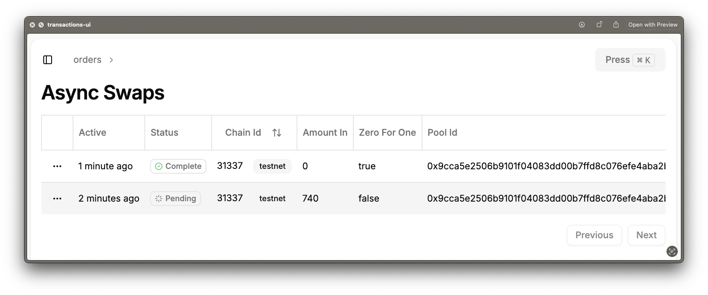
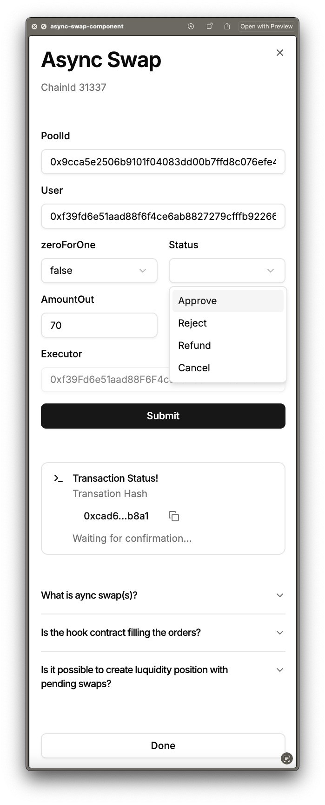

# Async Swapp CSMM Hook

Frontend + Indexer + Foundry monorepo for end-to-end development of Uniswap V4 hooks.

## Install

To install dependencies

> [!NOTE]
> This will install dependencies from all our packages in `packages/*`

```bash
bun install
```

## Setup

> [!TIP]
> Set up local anvil node, and create wallet from anvil accounts
>
> - This allows us to use `--account anvil` in our deploys scripts
>
> ```sh
> cast wallet import --mnemonic "test test test test test test test test test test test junk" anvil
> ```

Run local anvil node

```sh
anvil
# or to simulate block mining
anvil --block-time 1
```

## Async CSMM local deplyement

Run start scripts

```sh
./start_script.sh # scripts that you use --account setup of you choice
```

> [!NOTE]
>
> Start scripts do the following:
>
> 1. Deploy local PoolManger
> 2. Deploy Hook & Router contracts
> 3. Initialize a pool with your hook attached
> 4. Add liqudity to previously initialized pool

## Offchain Indexer `packages/indexer`

Start local indexer

```sh
bun run dev
```

> [!NOTE]
>
> You can also run indexer directly form its directory
>
> ```sh
> cd packages/indexer && bun run dev
> ```

Go to [http://localhost:42069](http://localhost:42069) to query orders and hook events

## Frontend UI

Front end repo lives here [repo](https://github.com/classcool/frontend) and [live demo](https://frontend-mu-one-27.vercel.app/dashboard)





Development frontend here
