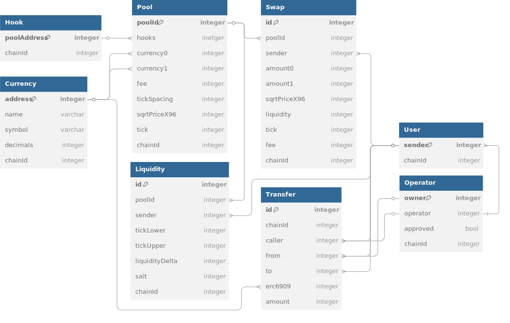

# DB Indexer

> [!NOTE]
>
> Runs locally on anvil on `--rpc-url http:localhost:8545` and can be configured to run on testnet or live mainnet

## PoolManager

Listens for event

- [x] Initialize
- [x] Transfer
- [x] SetOperator
- [x] Swap
- [x] ModifyLiquidity
- [x] Transfer

Relational Database model

## PositionManager
